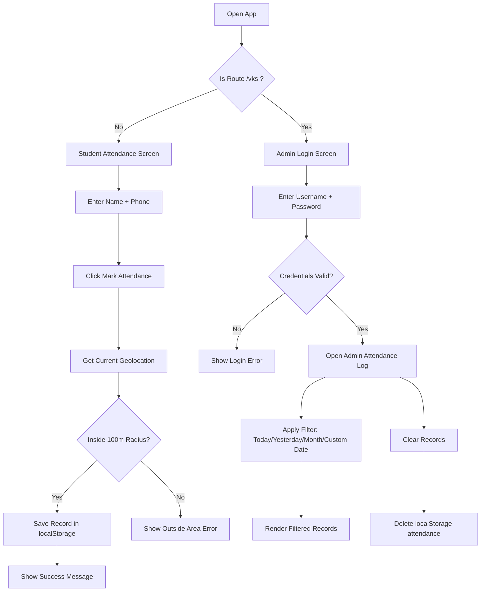
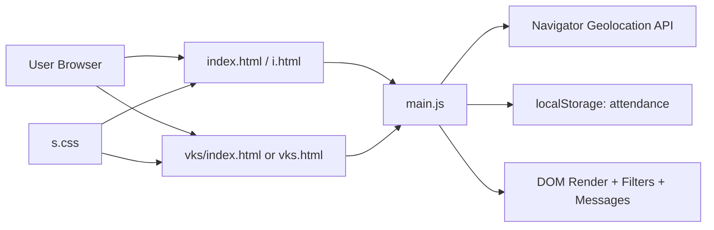

# Medinglish Attendance System

Professional, location-based attendance web app with student check-in and secure admin log view.

## Project Summary

This project is built as a **static frontend app** (HTML/CSS/JS) and works **without any database**.
All attendance records are stored in browser `localStorage`.

Implemented files:

- `index.html` (main entry)
- `vks/index.html` (admin route page)
- `vks.html` (admin fallback page for direct file-open usage)
- `main.js` (attendance + auth + filtering logic)
- `s.css` (full UI styling)
- `i.html` (base template synced to route pages)

## Features Implemented

### Student Side

- Name + Phone input based attendance form
- Geo-location verification (allowed radius: `100m`)
- Success/error/info status messages
- Data stored locally (`localStorage`)
- Responsive and modern UI


## Data Storage (No Database)

- Storage Key: `attendance`
- Storage Type: Browser `localStorage`
- Record format:

```json
{
  "name": "Student Name",
  "phone": "9876543210",
  "timestamp": "local date-time string",
  "isoTimestamp": "ISO date-time string",
  "distance": 42
}
```

## Route Support

- Student page: `/` (or `index.html`)
- Admin page: `/vks/`
- Admin fallback: `vks.html`

## App Flowchart



## Architecture Diagram



## Admin Filter Logic (Quick Reference)

- **Today**: records matching current local date
- **Yesterday**: records matching previous local date
- **1 Month**: records between now and one month ago
- **Calendar Date**: records matching selected date

## How to Run

1. Open project in Live Server / local static server
2. Open:
   - Student: `http://localhost:<port>/`
   - Admin: `http://localhost:<port>/vks/`
3. If direct file mode is used, open `vks.html` for admin view

## Notes

- No backend and no external database used
- Data is browser-specific (clearing browser storage removes records)
- Hard refresh (`Ctrl + F5`) may be required after UI updates

